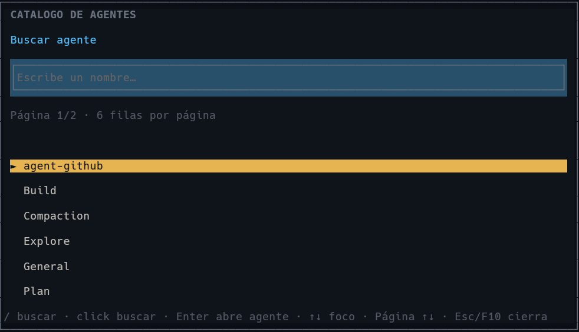
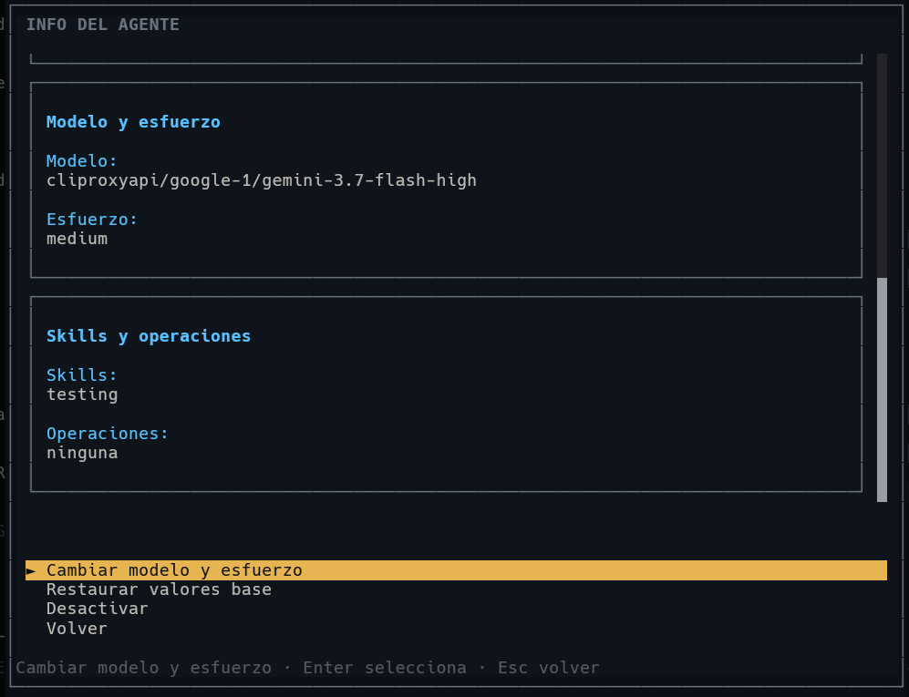

# Suite de Agentes

[](package.json)
[](package.json)
[](package.json)
[](LICENSE)

**Suite de Agentes** (`opencode-agent-suite`) is an independent OpenCode plugin providing a native OpenTUI agent catalog, per-agent AI model and effort assignment, and strict per-turn consent controls for multi-agent workflows.

---

## Why Suite de Agentes?

When running complex AI agent workflows, managing model assignments and maintaining strict security boundaries can be challenging. Suite de Agentes solves these challenges by providing:

- **Centralized Agent Catalog**: A fast, keyboard-driven OpenTUI interface to inspect registered built-in and custom agents, their skills, and operational prompts.
- **Dynamic Model & Effort Assignment**: Change providers, models, and reasoning effort tiers per agent directly from the terminal without manual JSON editing.
- **Strict Security & Per-Turn Consent**: Prevents unauthorized sub-agent execution by enforcing an explicit allowlist for internal orchestrators and requiring per-turn user consent for external or custom agents.
- **Clean Sibling Architecture**: Decoupled from internal orchestrator lifecycles, ensuring lightweight execution and safe fallback.

---

## Visual Tour

Explore the OpenTUI interface directly inside OpenCode:

### 1. Agent Catalog (`Catálogo`)
Browse, search, and navigate across all available seed and custom agents.


*Figure 1: Fast, searchable agent catalog with real-time filtering, pagination, and continuous arrow navigation.*

### 2. Agent Details & Configuration
Inspect agent status, capabilities, and assignment options.


*Figure 2: Comprehensive agent details showing membership, operational status, and management actions.*

### 3. Model, Skills, and Prompt Directives
View assigned reasoning models, registered skills, and operation instructions.


*Figure 3: Detailed view of model configuration, effort level, registered skills, and prompt instructions.*

### 4. Interactive Provider & Model Selection
Assign AI providers and models discovered directly from the active OpenCode runtime.


*Figure 4: Select an active AI provider, model, and effort tier in a few keystrokes.*

---

## Key Features

- **Native OpenTUI Terminal Interface**: Built with Solid and OpenTUI for smooth, zero-latency rendering.
- **Continuous Keyboard Navigation**: Arrow keys (`↑` / `↓`) navigate continuously across page boundaries; `PageUp` / `PageDown` switch pages; `/` jumps straight to search.
- **Runtime Provider Discovery**: Reads available AI models directly from OpenCode runtime state.
- **Isolated Atomic Persistence**: Stores configurations in `~/.config/opencode/agent-suite/suites.json` with restricted permissions (`0600`) and atomic temporary-file replacement.
- **Hardened Task Permissions**: Applies `*` deny policy with exact allowlists for internal orchestration agents (`sdd-*`, `review-*`, `jd-*`).
- **Session Consent Ledger**: Tracks per-turn user authorization grants (`usa también agente: <agent-id>`) that fail closed and never leak across turns.

---

## Quick Start

This package is designed as a local OpenCode plugin.

### 1. Build from Source
```sh
npm install
npm run build
```

### 2. Configure OpenCode
Add the server entry to your `opencode.json` and the TUI entry to `tui.json`:

```json
// ~/.config/opencode/opencode.json
{
  "plugin": [
    "/path/to/suite-de-agentes/dist/server.js"
  ]
}
```

```json
// ~/.config/opencode/tui.json
{
  "plugin": [
    "/path/to/suite-de-agentes/dist/tui.js"
  ]
}
```

*(On Windows, use absolute paths like `C:\\path\\to\\suite-de-agentes\\dist\\server.js`.)*

### 3. Launch Suite de Agentes
Restart OpenCode, then open the interface with any of the following:
- Press **`Alt+S`**
- Run **`/agent-suite`** in the chat prompt
- Select **Suite de Agentes** from the command palette

For detailed platform setup, see the [Local Installation Guide](docs/local-install.md).

---

## Keyboard Navigation Reference

| Key | Context | Action |
|---|---|---|
| `Alt+S` | Global | Toggle Suite de Agentes |
| `/agent-suite` | Chat prompt | Open Suite de Agentes |
| `↑` / `↓` (or `←` / `→`) | Catalog | Move selection continuously across pages |
| `PageUp` / `PageDown` | Catalog | Move one page backward / forward |
| `/` | Catalog | Focus search input field |
| `Enter` | Catalog | Open details for the selected agent |
| `g` | Catalog | View active session grants |
| `Esc` | Search focused | Return focus to catalog results |
| `Esc` | Catalog | Close Suite de Agentes |
| `Esc` | Details / Sub-screen | Return to previous view |
| `F10` | Catalog | Quick exit to OpenCode |

For a complete walkthrough of all interface screens and workflows, see the [UI & Interaction Guide](docs/ui-guide.md).

---

## Security & Consent Model

When `gentle-orchestrator` is the active session agent:
1. **Internal Allowlist**: Internal system agents (`sdd-*`, `review-*`, `jd-*`) are permanently authorized to execute tasks.
2. **Explicit User Consent**: User agents (`general`, `agent-github`, custom agents) require an explicit, current-turn consent line:
   ```text
   usa también agente: agent-github
   ```
3. **Fail-Closed Verification**: Grants are bound to the specific `sessionID` and message ID. They do not persist across turns and cannot be granted via static configuration or prompt injection.
4. **Runtime Hardening**: The server `config` hook applies `transformTaskPermission()` to restrict task execution to authorized targets.

For complete architectural details and security boundaries, see [Architecture Documentation](docs/architecture.md).

---

## Documentation Map

- **[UI & Interaction Guide](docs/ui-guide.md)**: Visual walkthrough, screen breakdowns, and interaction patterns.
- **[Local Installation Guide](docs/local-install.md)**: Windows (PowerShell) and POSIX installation steps and configuration examples.
- **[Architecture & Trust Model](docs/architecture.md)**: Deep dive into module boundaries, consent verification, and persistence.
- **[Project Status](docs/PROJECT-STATUS.md)**: Product boundaries, workstream history, and verification records.
- **[Contributing Guide](CONTRIBUTING.md)**: Issue-first workflow, commit standards, and local development gates.

---

## Development & Testing

```sh
# Install dependencies
npm install

# Run unit and integration tests
npm test

# Run strict TypeScript checks
npm run typecheck

# Build bundle
npm run build
```

---

## Contributing

We welcome contributions! Please review our [Contributing Guide](CONTRIBUTING.md) before submitting pull requests. All changes must originate from an approved GitHub issue.

---

## License

This project is licensed under the [MIT License](LICENSE).
